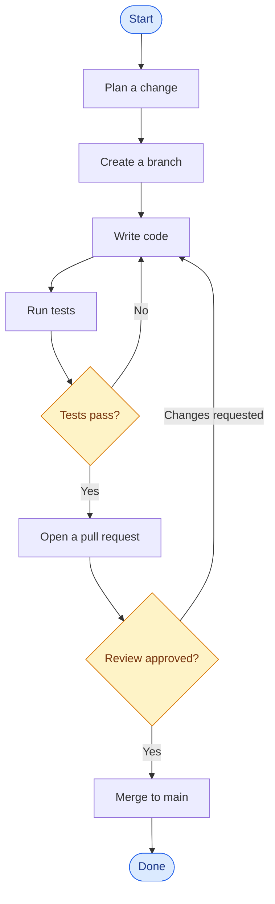

# dsadasd

## Development workflow

A simple example workflow for developing and reviewing changes.

```mermaid
flowchart TD
    A([Start]) --> B[Plan a change]
    B --> C[Create a branch]
    C --> D[Write code]
    D --> E[Run tests]
    E --> F{Tests pass?}
    F -- No --> D
    F -- Yes --> G[Open a pull request]
    G --> H{Review approved?}
    H -- Changes requested --> D
    H -- Yes --> I[Merge to main]
    I --> J([Done])

    classDef milestone fill:#dbeafe,stroke:#2563eb,color:#1e3a8a
    classDef decision fill:#fef3c7,stroke:#d97706,color:#78350f
    class A,J milestone
    class F,H decision
```
